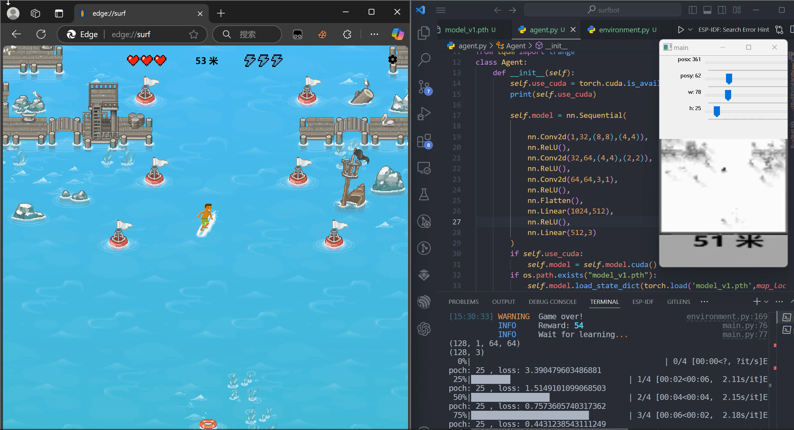
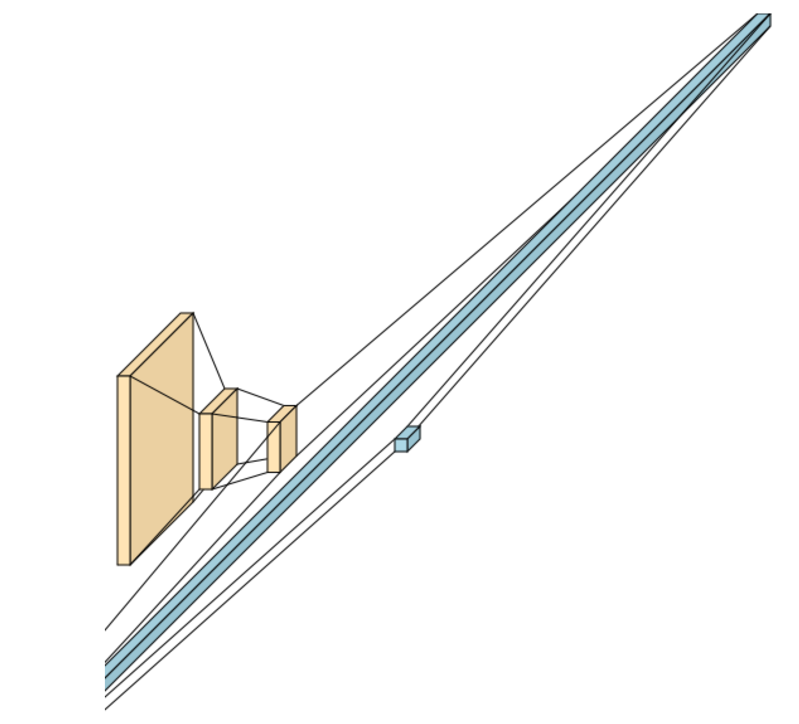
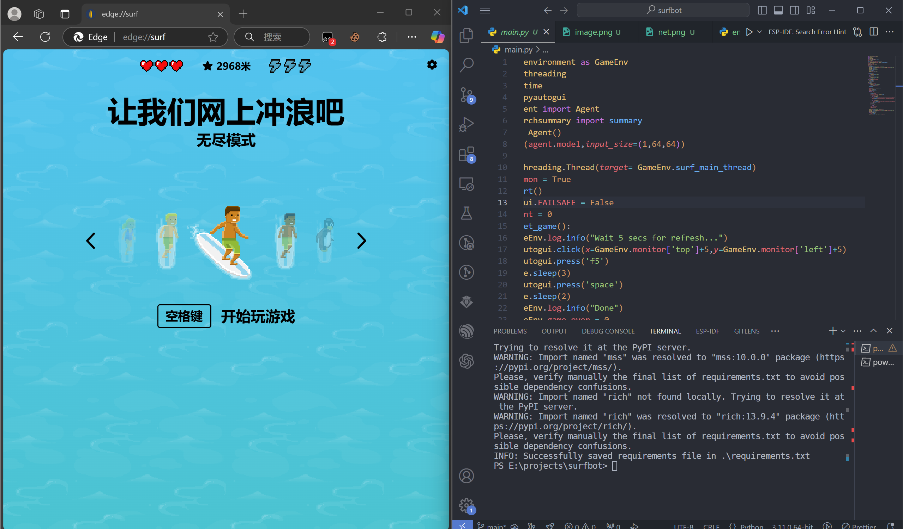
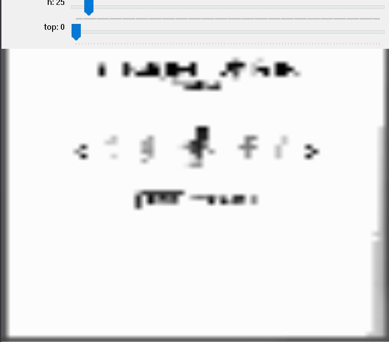
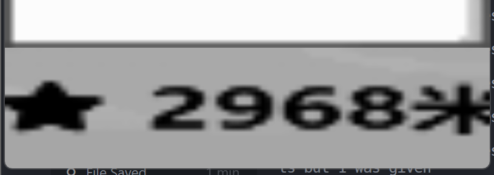

# Surfbot



## 1. 这是什么？
**surfbot**是一个基于pytorch和DQN深度学习算法的AI, 可以自动学习并游玩edge浏览器自带的[surf小游戏](edge://surf)(请用edge浏览器打开)  

## 2. 神经网络架构
输入为64*64的灰度图，经过3个卷积层，flatten到1024个节点，然后经过一层隐藏层(512节点)，最终输出层为3个节点，分别代表左，下，右三种按键操作的概率

```
----------------------------------------------------------------
        Layer (type)               Output Shape         Param #
================================================================
            Conv2d-1           [-1, 32, 15, 15]           2,080
              ReLU-2           [-1, 32, 15, 15]               0
            Conv2d-3             [-1, 64, 6, 6]          32,832
              ReLU-4             [-1, 64, 6, 6]               0
            Conv2d-5             [-1, 64, 4, 4]          36,928
              ReLU-6             [-1, 64, 4, 4]               0
           Flatten-7                 [-1, 1024]               0
            Linear-8                  [-1, 512]         524,800
              ReLU-9                  [-1, 512]               0
           Linear-10                    [-1, 3]           1,539
================================================================
```

## 3. 如何使用？

### 1. 安装依赖
**注意** 源代码不包含训练好的模型，模型请看下方指示到release页面下载
```
pip3 install -r requirements.txt
```

### 2. 启动游戏
- 打开edge
- 地址栏输入 **edge://surf**

### 3. 布局
- 用windows徽标 + 左 键，将 edge浏览器放到左边
- 然后将vscode或者cmd放到右边
- 效果如图：


### 4. 启动
**注意**: 如果使用预训练模型，请将[release](https://github.com/qiufuyu123/surfbot/releases)页面下载的模型放到同一目录下，并命名为model_v1.pth  
- 执行:
```
python.exe ./main.py
```
- 程序会输出当前所有活动窗口的名字  
- 找到edge浏览器的窗口，将前面的序号输入，回车（注意，可能要输入两遍）
- 等待opencv窗口出现
- 调整**top**滑块的数值(默认是0，如果效果差不多就不用改了)，直到游戏灰度图页面类似下图：  
(游戏主体完全被窄黑色边框包裹，上方黑字类似下图正好卡在顶部位置)

- 调整剩下4个滑块，让底部的灰度图将分数显示完整包裹住：


### 5. 运行模型  
- 完成步骤4的调整后，在命令行里输入 **pause** 回车
- 然后不要做仍和多余的鼠标操作，程序会自动运行